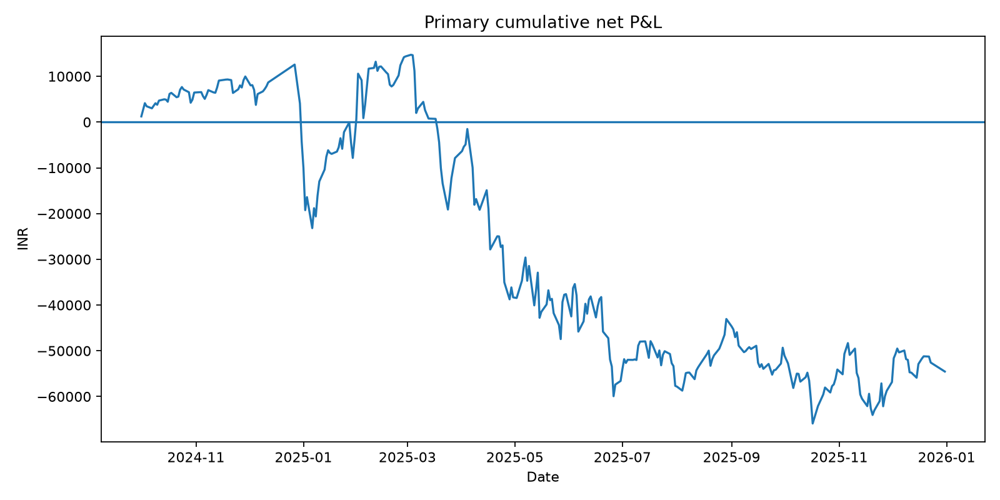
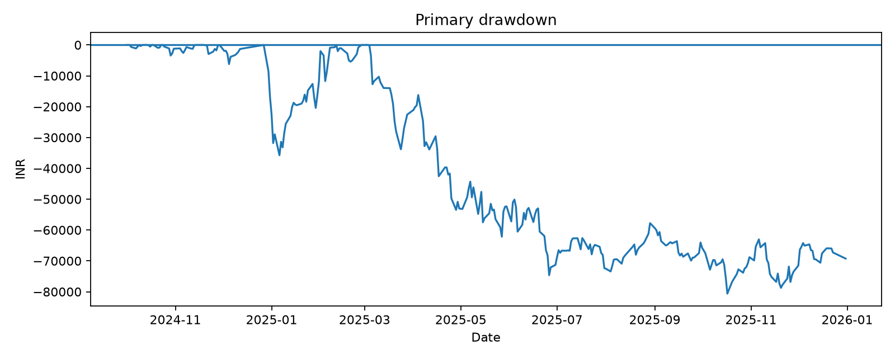
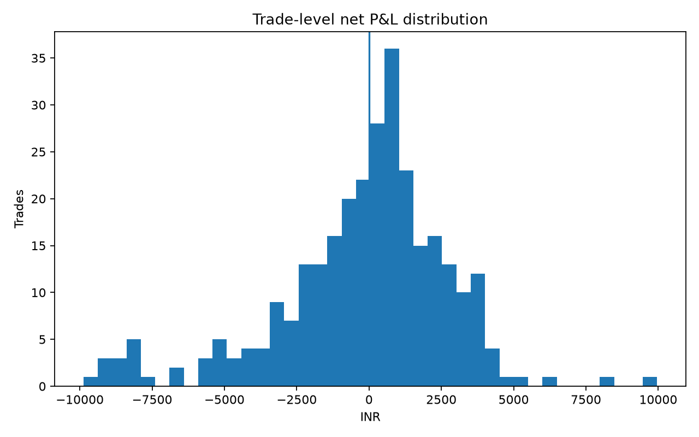

# Intraday Asymmetric Premium Strategy in NIFTY 50 Index Options

## A Reproducible Cost-Aware Backtest of a Current-Week Call / Next-Week Put Strategy

**Study window:** 2024-10-01 to 2025-12-31  
**Primary validated trades:** 296  
**Status:** Phase 9 complete

## Abstract

This study evaluates a deterministic implementation of an intraday asymmetric premium strategy in NIFTY 50 index options. At 09:30 IST the strategy sells one near-at-the-money current-week call and one near-at-the-money next-week put. When the lower premium falls to 50% or less of the higher premium, the lower-premium leg is rolled to the strike whose next-bar-open premium most closely matches the higher premium. A combined 100-option-point stop-loss and a 15:15 IST regular exit are used. No overnight exposure or discretionary re-entry is permitted.

The validated public one-minute option sample covers October 2024 through December 2025. Historical contract-lot regimes, missing observations, expiry ordering, near-ATM availability and duplicate keys were explicitly validated. The primary model includes ₹10 per-order brokerage, statutory charges and 1 option-point adverse slippage per executed contract.

Across 296 completed trades, gross raw P&L was **₹127,063.40**, slippage was **₹134,540.00**, transaction costs were **₹47,060.19**, and net P&L was **−₹54,536.79**. Win rate was **55.41%**, profit factor **0.844**, and maximum drawdown **−₹80,611.36**. The 95% bootstrap interval for mean trade P&L was approximately **−₹522 to ₹153**. The strategy therefore does not demonstrate economically reliable profitability under the primary cost model.

A chronological July–December 2025 forward slice was slightly positive (+₹2,056.67), but it was not prospectively sequestered and must not be presented as confirmatory out-of-sample evidence.

## 1. Research Questions

1. Does the locked strategy generate economically meaningful returns after realistic costs?
2. How often do adjustment and stop-loss events occur?
3. Is performance robust to slippage and transaction costs?
4. Is performance stable across weekday, lot-size and volatility regimes?
5. Can the final result be independently reproduced?
6. What does a chronological forward slice show with frozen parameters?

## 2. Aim and Objectives

The aim was to determine whether the specified intraday asymmetric option-premium strategy has reproducible economic value after realistic implementation friction.

Objectives were to freeze qualitative rules, validate public minute data, reconcile historical lot sizes, implement a no-look-ahead engine, model all major execution costs, generate complete ledgers, perform statistical and robustness analysis, independently reproduce the result, and close with a transparent manuscript.

## 3. Locked Strategy

The canonical rulebook is in STRATEGY_SPEC.md.

| Component | Rule |
|---|---|
| Entry | 09:30 IST |
| Current leg | Sell 1 nearest available near-ATM Call |
| Next leg | Sell 1 nearest available near-ATM Put |
| Near ATM | Nearest strike; maximum 25-point distance in the validated 50-point strike grid |
| Trigger | Lower premium / higher premium ≤ 0.50 |
| Adjustment | Roll lower-premium leg at next-bar open to closest premium-matching strike |
| Stop | Combined 100 option-point maximum loss |
| Regular exit | 15:15 IST open |
| Re-entry | Disabled because no deterministic rule was supplied |
| Missing prices | No forward fill |
| Primary slippage | 1.0 option point per executed contract |

## 4. Literature Review

The study is grounded in established research on option risk premia, implied-volatility structure, short-option tail risk, transaction costs and intraday market microstructure.

Coval & Shumway (2001) document nontrivial expected option returns. Bakshi & Kapadia (2003) study delta-hedged option gains and the negative volatility risk premium. Broadie, Chernov & Johannes (2009) examine index option returns. Bollen & Whaley (2004) show that demand pressure affects the implied-volatility surface, which is relevant when a strategy changes strikes based on premium relationships. Leland (1985) and Boyle & Vorst (1992) demonstrate the importance of transaction costs for derivative replication and hedging. Black & Scholes (1973) and Merton (1973) provide the classical theoretical option-pricing foundations.

These studies do not validate this exact NIFTY 50 rule. The contribution here is reproducible empirical testing, cost accounting and independent audit rather than a claim of theoretical novelty.

## 5. Scientific Methodology

### Data

The primary option data are from a pinned public Hugging Face revision containing NIFTY one-minute data for 2024 and 2025. NIFTY spot data are from a pinned public GitHub release. Public/free sources were prioritized before paid sources.

### Validation

Validation covered required fields, timestamp chronology, OHLC consistency, duplicate keys, session contamination, 09:30 spot availability, expiry ordering, historical lot sizes, contract availability and near-ATM source gaps. The frozen primary universe contains 296 eligible dates.

### Chronology

Signals use completed minute-bar closes. Triggered adjustments and stop-loss executions occur at the following minute-bar open. Future strike selection uses only prices available at execution time. Missing data are not forward-filled.

### Costs

Brokerage, STT, exchange charges, IPFT, SEBI fee, GST and stamp duty are separately recorded. Adverse slippage is 1 point per executed contract in the primary model. Gross and net P&L are retained separately.

### Statistics

The study reports mean/median P&L, win rate, profit factor, maximum drawdown, annualized daily Sharpe and Sortino diagnostics, skewness, excess kurtosis, 5% VaR/Expected Shortfall, bootstrap confidence intervals, monthly performance, event frequencies and pre-specified robustness strata.

## 6. Primary Results

| Metric | Result |
|---|---:|
| Eligible dates | 296 |
| Completed trades | 296 |
| Gross raw P&L | ₹127,063.40 |
| Slippage | ₹134,540.00 |
| Transaction costs | ₹47,060.19 |
| **Net P&L** | **−₹54,536.79** |
| Mean trade P&L | −₹184.25 |
| Median trade P&L | ₹262.53 |
| Win rate | 55.41% |
| Profit factor | 0.844 |
| Maximum drawdown | −₹80,611.36 |
| Stop-loss trades | 15 |
| Trades with adjustments | 249 |
| Total adjustments | 428 |
| Sharpe, annualized, ₹2L reference | −0.978 |
| Sortino, annualized, ₹2L reference | −1.165 |
| Return on ₹2L reference | −27.27% |
| Return on ₹2.5L reference | −21.81% |

### Distribution

Trade P&L skewness was −0.785 and excess kurtosis 1.548. 5% VaR was −₹5,919.76 and 5% Expected Shortfall was −₹8,290.60. The worst trade was −₹9,875.32 and the best was ₹9,963.24. The bootstrap 95% interval for mean trade P&L was −₹522.01 to ₹153.38.

### Cost decomposition

**₹127,063.40 gross − ₹134,540.00 slippage − ₹47,060.19 transaction costs = −₹54,536.79 net.**

### Slippage stress

| Slippage | Net P&L |
|---:|---:|
| 0.0 points | +₹80,003 |
| 0.5 points | +₹12,733 |
| 1.0 point | −₹54,537 |
| 2.0 points | −₹189,077 |
| 3.0 points | −₹323,617 |

Approximate break-even adverse slippage is **0.59 points per executed contract**.

### Volatility regimes

A pre-specified 20-trading-day realized-volatility proxy from 09:30 NIFTY observations split the sample at its median. Low volatility: 148 trades, −₹14,005.52. High volatility: 148 trades, −₹40,531.26. Both regimes were negative.

## 7. Figures

*Figure 1. Cumulative primary net P&L.*

*Figure 2. Primary trade-level drawdown.*

*Figure 3. Trade-level net P&L distribution.*

## 8. Chronological Forward Slice

A cutoff of 2025-07-01 gives 175 earlier trades and 121 later trades.

| Slice | Trades | Net P&L | Profit factor |
|---|---:|---:|---:|
| 2024-10-01 to 2025-06-30 | 175 | −₹56,593.46 | 0.772 |
| 2025-07-01 to 2025-12-31 | 121 | +₹2,056.67 | 1.021 |

At 1-point slippage the later slice is only marginally positive; at 2 points it becomes −₹59,683.33. Critically, the split was formalized after the full-sample primary run. It is therefore a **retrospective chronological diagnostic, not prospective OOS validation**.

## 9. Discussion

The main finding is that the strategy does not survive the primary execution model. Gross raw P&L is positive, but frequent execution makes slippage economically dominant. A win rate above 50% is misleading because the loss distribution and implementation costs produce a profit factor below one.

The 428 adjustments over 296 trades highlight the microstructure dependence of the rule. The later forward slice does not overturn the primary conclusion because it is only slightly positive and changes sign under a modest increase in slippage.

The appropriate inference is therefore that the current rule is not validated as a robust profitable strategy. This is not evidence that every premium-relative strategy is unprofitable; it is evidence that this specified implementation has insufficient margin over realistic execution friction in the validated sample.

## 10. Strengths

- Frozen deterministic rulebook.
- Public reproducible data and hashes.
- Historical lot-size reconciliation.
- No forward-fill and next-bar execution.
- Separate raw P&L, slippage and statutory costs.
- Complete trade and execution ledgers.
- Automated cached workflows.
- Multiple developer/tester gates.
- Independent aggregate reproduction.
- Robustness without parameter optimization.
- Explicit qualification of the forward slice.

## 11. Limitations

1. The validated option sample ends in 2025.
2. The source is minute-level public data rather than exchange-direct tick data.
3. Intrabar ordering cannot be reconstructed exactly from one-minute OHLC.
4. Fixed slippage is a proxy, not historical broker fills.
5. Historical broker pricing may differ from the current public brokerage parameter.
6. Qualitative source terms required deterministic operationalization.
7. Re-entry is disabled because the source rule lacks a deterministic trigger.
8. The forward slice was not prospectively sequestered.
9. No live or paper execution study was performed.
10. No causal or live profitability claim is justified.

## 12. Conclusion

The locked strategy generated **−₹54,536.79 net P&L** across 296 completed trades under the primary 1-point slippage and transaction-cost model. Despite a 55.41% win rate, profit factor was 0.844 and drawdown was substantial. The economics are strongly friction-sensitive.

**Conclusion: the strategy should not currently be treated as a validated profitable trading strategy.**

## 13. Future Research

Future work should focus on broker-level bid/ask/fill data, liquidity, option-surface state, India VIX and global overnight regimes, FII/DII flows, execution-frequency reduction, prospectively locked development/validation/OOS splits, and independent live/paper-trading validation. Any strategy modification must begin a new research project with a new frozen specification and fresh tester gates.

## 14. Evidence Map

- Strategy: STRATEGY_SPEC.md
- Plan: RESEARCH_PLAN.md
- Primary result: research/results/PRIMARY_BACKTEST_SUMMARY.json
- Statistics: research/results/PRIMARY_STATISTICS.json
- Trade ledger: research/results/trade_ledger.csv
- Execution ledger: research/results/execution_ledger.csv
- Robustness: research/results/ROBUSTNESS_SUMMARY.json
- Forward diagnostic: research/results/OOS_FORWARD_DIAGNOSTIC.json
- Independent audit: research/results/INDEPENDENT_AUDIT.json
- Error log: research/logs/ERROR_LOG.md
- Research log: research/logs/RESEARCH_LOG.md
- Tester gates: research/tester/GATE_P4_AUDIT.md through GATE_P8_AUDIT.md

## Appendix A — Gate Summary

| Gate | Outcome |
|---|---|
| P0 Governance | Passed |
| P1 Specification | Passed |
| P2 Data | Passed |
| P3 Validation | Passed |
| P4 Engine | Passed after remediation |
| P5 Primary backtest | Passed |
| P6 Robustness | Passed |
| P7 Independent reproduction | Passed |
| P8 Forward diagnostic | Passed with non-prospective qualification |
| P9 Manuscript | Complete |

## Appendix B — Error and Remediation Summary

The study recorded and remediated timestamp-validation issues, an over-strict completeness gate, lot-size cutoffs, a test arithmetic error, stale engine fields, an omitted near-ATM data-quality guard, and a stale primary-summary artifact. The invalid 301-trade result was explicitly superseded by the validated 296-trade result.

## Appendix C — References

1. Black, F. & Scholes, M. (1973). The pricing of options and corporate liabilities. Journal of Political Economy.
2. Merton, R. C. (1973). Theory of rational option pricing. Bell Journal of Economics and Management Science.
3. Leland, H. E. (1985). Option pricing and replication with transactions costs. Journal of Finance.
4. Coval, J. D. & Shumway, T. (2001). Expected option returns. Journal of Finance.
5. Boyle, P. P. & Vorst, T. (1992). Option replication in discrete time with transaction costs. Journal of Finance.
6. Bakshi, G. & Kapadia, N. (2003). Delta-hedged gains and the negative market volatility risk premium. Review of Financial Studies.
7. Bollen, N. P. B. & Whaley, R. E. (2004). Does net buying pressure affect the shape of implied volatility functions? Journal of Finance.
8. Broadie, M., Chernov, M. & Johannes, M. (2009). Understanding index option returns. Review of Financial Studies.

## Appendix D — Research Closure

The planned phases are complete. No further parameter search is authorized within this study. Any modification to strategy rules, data windows, execution assumptions or re-entry logic must be a separately scoped research study.
